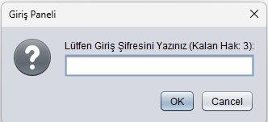

Süleyman Demirel Üniversitesi - Mühendislik Fakültesi
Bilgisayar Mühendisliği Bölümü - Programlama II Dönem Projesi
Gelişmiş "Adam Asmaca" Oyunu (Java Swing GUI)
Bu repository, Java programlama dili ve Swing GUI kütüphanesi kullanılarak geliştirilmiş, dosya tabanlı çalışan dinamik bir "Adam Asmaca" (Hangman) projesidir. Proje, nesne yönelimli programlama (OOP) prensiplerine uygun olarak tasarlanmış olup, veri kalıcılığı (Data Persistence) ve sistem güvenliği (Authentication) ön planda tutulmuştur.

🛠️ Sistem Gereksinimleri ve Dosya Mimarisi
Hocamızın belirttiği isterler doğrultusunda sistem, kod satırlarına müdahale edilmeksizin tamamen dış dosya bağımlılıklarıyla (C:\P2Oyun\) çalışmaktadır.

C:\P2Oyun\
├── Resimler\
│   ├── 1.jpg (Boş darağacı resmi)
│   ├── 2.jpg
│   └── ... 11.jpg (Oyunun sonlanma aşaması)
└── TXTDosyalar\
    ├── kelimeler.txt (En az 6 harfli 30 adet kelime)
    ├── sifre.txt     (MD5/Düz metin formatında sistem şifresi)
    ├── log.txt       (Zaman damgalı sistem logları)
    └── oyunlar.txt   (Geçmiş oyun skor verileri)

    Proje isterleri ve Teknik Çözümlerimiz
1. Dosya Tabanlı Şifre ve Güvenlik Mekanizması
İlk Kurulum Kontrolü: Uygulama başlatıldığında main metodu C:\P2Oyun\TXTDosyalar\sifre.txt dosyasını kontrol eder. Eğer dosya mevcut değilse veya boşsa, kullanıcıya JOptionPane arayüzü ile yeni bir şifre tanımlatır ve kalıcı olarak kaydeder.

3 Hak Sınırı ile Giriş: Şifre kayıtlı ise kullanıcıya 3 giriş hakkı tanınır. Girilen şifreler dosyadaki veriyle runtime esnasında doğrulanır. 3 defa hatalı şifre girilmesi durumunda program System.exit(0); fonksiyonu ile tamamen sonlandırılır.

2. Zaman Damgalı Loglama Sistemi 
Kullanıcının her şifre denemesinde, başarılı/başarısız girişlerinde ve veri temizleme taleplerinde java.time.LocalDateTime sınıfı kullanılarak [yyyy-MM-dd HH:mm:ss] formatında zaman damgaları (timestamp) üretilir ve log.txt dosyasına append (ekleme) moduyla yazılır.

4. JMenuBar ve JTabbedPane ile Katmanlı Mimari
Proje en üst seviyede bir JMenuBar (Seçenekler -> Oyuna Başla / Yeniden Başlat) içerir.

Ana ekran JTabbedPane ile 3 farklı fonksiyonel sekmeye bölünmüştür: Oyun Oyna, Eski Skorlar ve Loglar.

4. Oyun Oyna Sekmesi Teknik Detayları 
Dinamik JLabel Üretimi: kelimeler.txt içerisinden rastgele seçilen min. 6 harfli kelimenin uzunluğu çalışma zamanında (runtime) hesaplanır. Harf adedince dinamik JLabel bileşeni oluşturularak pnlHarfler içerisine atanır ve başlangıçta * maskesi uygulanır.

Çift Input Alanı: Harf denemeleri (txtHarfTahmin) ve kelime tahminleri (txtKelimeTahmin) için ayrı event handle mekanizmaları kurulmuştur.

Görsel Durum Değişimi: Kullanıcının her hatalı harf veya kelime tahmininde yanlisTahminSayisi artırılır ve lblResim üzerindeki ImageIcon nesnesi C:\P2Oyun\Resimler\ dizinindeki bir sonraki aşama görseliyle güncellenir. 11. hatada oyun elenme algoritması tetiklenir.

Sürekli Sayaç Kontrolü: Oyun başladığı an javax.swing.Timer saniyelik (1000ms) interval ile asenkron olarak çalışır ve lblSure alanını günceller. Oyun bitiminde elde edilen veriler doğrudan oyunlar.txt dosyasına raporlanır.

5. JTable Listeleme ve Güvenli Temizleme
Hem Eski Skorlar hem de Loglar sekmelerinde veriler ham metin olarak değil, DefaultTableModel mimarisiyle JTable nesnelerine satır satır (addRow) eklenerek kullanıcıya şık bir grid yapısında sunulur.

Alt kısımlarda bulunan "Temizle" butonları, dosya silme işleminden önce JOptionPane.showInputDialog ile yönetim şifresi talep eder. Doğrulama başarılı ise ilgili dosya stream'i false parametresiyle açılarak içerik tamamen temizlenir ve sistem logu düşülür.

💻 Kullanılan Teknolojiler
Dil: Java 8 veya üzeri (JDK)

Arayüz Teknolojisi: Java Swing GUI & AWT

IDE: Apache NetBeans IDE

Dosya Yönetimi: Java IO (BufferedReader, BufferedWriter, FileWriter, Files)

Geliştirici: Ali Özdamar

Öğrenci Numarası: 2416501008

SDÜ Bilgisayar Mühendisliği - 2026
